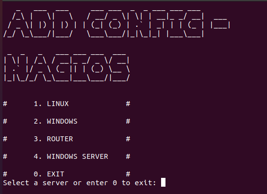
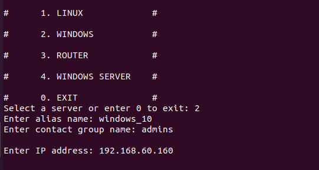
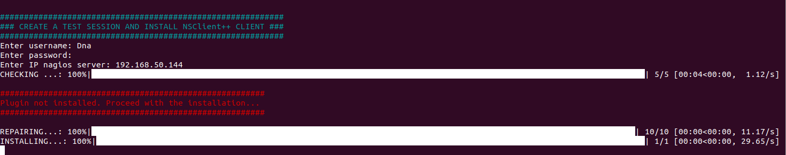
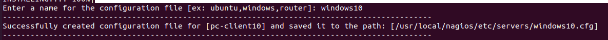
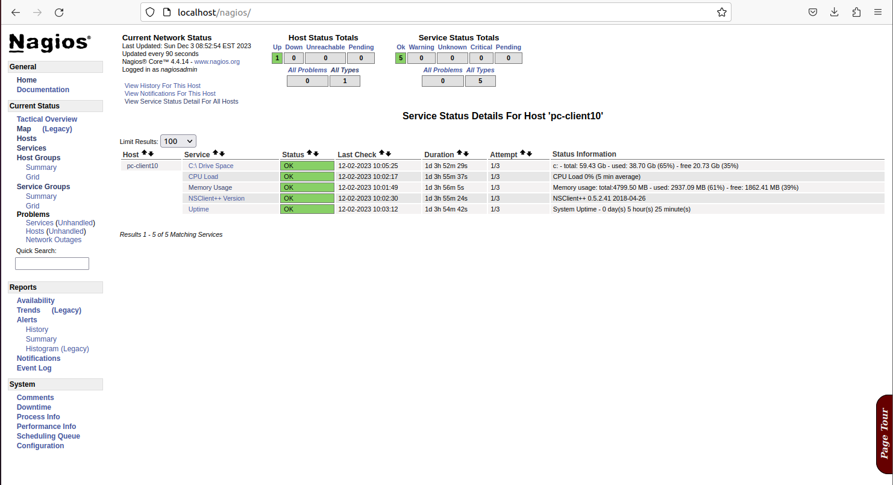

# Nagios Core Automation Tool


## Introduce

This Python tool is an application that automates the configuration and deployment process for the Nagios Core monitoring system. It is designed to help system administrators configure and deploy Nagios Core easily and efficiently.

## Function

This tool provides the following functions:

1. **Added support for Linux, Windows and Router configuration files for Nagios Core monitoring:**
    - Allows users to add configuration files for different operating systems, including Linux, Windows and Router devices.
    - Easily add servers and devices to monitor to the Nagios Core system by specifying the corresponding configuration files.

2. **Automatically install plugins for Linux and Windows machines (Clients):**
    - Ability to automatically install plugins such as NRPE (Nagios Remote Plugin Executor) for Linux machines and NSClient++ for Windows machines.
    - These plugins are important components for performing monitoring on servers and clients.
    - Helps install plugins automatically and link them with Nagios Core to perform data retrieval processes and check client health.

## Instructions for installation and use
- Unzip the .zip file
     ```
     unzip nagios_tool.zip
     ```
- Run the software with the command:
     ```
     python nagios_tool.py
     ```
   or
     ```
     python3 nagios_tool.py
     ```
### Request
- Python 3.8 or newer.
- Installed SSH-Client on Windows operating system and OpenSSH on Linux (because the process of automatically installing plugins will mainly be through SSH)

### Required libraries:
- `os`: Library to support interaction with file and directory systems.
     ```
     pip install os
     ```
- `subprocess`: Library that allows executing processes and commands from Python.
     ```
     pip install subprocess
     ```
- `re`: (Regular Expressions): Library to process and search strings with regular expressions.
     ```
     pip install re
     ```
- `string`: Library that provides constants and methods for working with strings.
     ```
     pip install string
     ```
- `paramiko`: SSH interface library for Python.
     ```
     pip install paramiko
     ```
- `getpass`: Library that allows secure password entry from users.
     ```
     pip install getpass
     ```
- `tqdm`: Library that provides a progress bar to track execution progress.
     ```
     pip install tqdm
     ```
- `time`: Library containing functions and methods related to time.
     ```
     pip install time
     ```
- `paramiko.ssh_exception.SSHException`: Exception related to SSH connection.
## Tutorial

### This is the main interface of the tool:



#### Instructions for creating configuration files for Windows clients:
- Step 1: Enter some basic information such as IP address, alias, contact group.


- Step 2: Enter the client's username and password to connect and automatically install the necessary configuration on the client side
The tool will automatically check whether the client has installed the NSClient++ plugin or not?
Otherwise, the tool will install automatically



- Step 3: enter the configuration file name you want


#### Check the results on the Nagios Core monitoring page


## Conclude
Although this tool is still not optimized for many systems, it will also help you save time in composing declaration statements as well as configuration on the device you monitor.

## Author
Project by Nguyen Huynh Minh Dan - FPT University student

## Contact Info
- Phone: 0906 957 539
- Email: nhmdan2710@gmail.com
